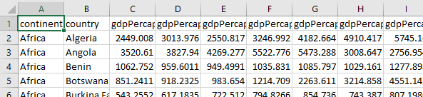
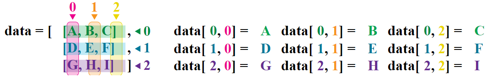
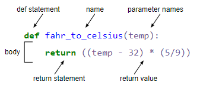

# Programming with Python

## Exercise 1.1

What do the variables `mass` and `age` have after executing each statement? Try to guess first then test your answer by executing the code.

```python
mass = 47.5
age = 122
mass = mass * 2.0
age = age - 20
```

<details>
<summary>Solution
</summary>

`mass` = 47.5, `age` does not exist   
<br>
`mass` = 47.5, `age` = 122    
<br>
`mass` = 95.0, `age` = 122  
 <br>
`mass` = 95.0, `age` = 102   
<br>
</details>

<br>
<br>
<br>
<br>
<br>

## Exercise 1.2

What does this program print out?

```python
first, second = 'Grace', 'Hopper'
third, fourth = second, first
print(third, fourth)
```

<details>
<summary>Solution
</summary>

Hopper Grace
</details>

<br>
<br>
<br>
<br>
<br>

## Exercise 1.3

What are the data types of the following variables?
```python
planet = 'Earth'
apples = 5
distance = 10.5
```

How would you check your guesses?

<details>
<summary>Solution
</summary>

type(planet)
<br>
type(apples)
<br>
type(distance)
<br>
</details>

<br>
<br>
<br>
<br>
<br>

## The Data
```
"continent","country","gdpPercap_1952","gdpPercap_1957","gdpPercap_1962","gdpPercap_1967","gdpPercap_1972","gdpPercap_1977","gdpPercap_1982","gdpPercap_1987","gdpPercap_1992","gdpPercap_1997","gdpPercap_2002","gdpPercap_2007","lifeExp_1952","lifeExp_1957","lifeExp_1962","lifeExp_1967","lifeExp_1972","lifeExp_1977","lifeExp_1982","lifeExp_1987","lifeExp_1992","lifeExp_1997","lifeExp_2002","lifeExp_2007","pop_1952","pop_1957","pop_1962","pop_1967","pop_1972","pop_1977","pop_1982","pop_1987","pop_1992","pop_1997","pop_2002","pop_2007"
"Africa","Algeria",2449.008185,3013.976023,2550.81688,3246.991771,4182.663766,4910.416756,5745.160213,5681.358539,5023.216647,4797.295051,5288.040382,6223.367465,43.077,45.685,48.303,51.407,54.518,58.014,61.368,65.799,67.744,69.152,70.994,72.301,9279525,10270856,11000948,12760499,14760787,17152804,20033753,23254956,26298373,29072015,31287142,33333216
"Africa","Angola",3520.610273,3827.940465,4269.276742,5522.776375,5473.288005,3008.647355,2756.953672,2430.208311,2627.845685,2277.140884,2773.287312,4797.231267,30.015,31.999,34,35.985,37.928,39.483,39.942,39.906,40.647,40.963,41.003,42.731,4232095,4561361,4826015,5247469,5894858,6162675,7016384,7874230,8735988,9875024,10866106,12420476
```
<br>
<br>
<br>
<br>
<br>


<br>
<br>
<br>
<br>
<br>

## Selecting Values


<br>
<br>
<br>
<br>
<br>

## Exercise 2.1: Slicing strings
We can take sections (or slices) of strings as well. Note here that the second index is not inclusive.

```python
element = 'oxygen'
print('first three characters:', element[0:3])
print('last three characters:', element[3:6])
```

```python
first three characters: oxy
last three characters: gen
```

What are the values of `element[:4]`, `element[4:]` and `element[:]`?

<details>
<summary>Solution
</summary>

`element[:4] = oxyg`
<br>
`element[4:] = en`
<br>
`element[:] = oxygen`

</details>
<br>
<br>

What is `element[-1]` and `element[-2]`?
 
<details>
<summary>Solution
</summary>

`n`

`e`

</details>

<br>
<br>
Given those answers, explain what element[1:-1] does.

<details>
<summary>Solution
</summary>

`element[1:-1]` = `xyge`
<br>
Creates a substring from index 1 up to (not including) the final index, effectively removing the first and last letters from ‘oxygen’

</details>
<br>
<br>

Rewrite `element[3:6]` (last 3 characters) to work with any length string.

How can we rewrite the slice for getting the last three characters of element (`element[3:6]`), so that it works even if we assign a different string to element? 

Test your solution with the following strings: `carpentry`, `clone`, `hi`.

<details>
<summary>Solution
</summary>

`element[3:6]` becomes `element[-3:]`

</details>
<br>
<br>
<br>
<br>
<br>

## Exercise 2.2
Assume Pandas has been imported into your notebook and the Gapminder GDP data for Europe has been loaded:

```python
import pandas as pd

df = pd.read_csv('data/gapminder_gdp_europe.csv', index_col='country')
```

Write an expression to find the Per Capita GDP of Serbia in 2007.

<details>
<summary>Solution
</summary>

The selection can be done by using the labels for both the row ("Serbia") and the column ("gdpPercap_2007"):

`print(df.loc['Serbia', 'gdpPercap_2007'])`

</details>
<br>
<br>
<br>
<br>
<br>

## Exercise 2.3

Assume Pandas has been imported and the Gapminder GDP data for Europe has been loaded. Write an expression to select each of the following:

1. GDP per capita for all countries in 1982.
2. GDP per capita for Denmark for all years.
4. GDP per capita for each country in 2007 as a multiple of GDP per capita for that country in 1952.

<details>
<summary>Solution
</summary>

1:
`data['gdpPercap_1982']`

2:
`data.loc['Denmark',:]`


3:
`data['gdpPercap_2007']/data['gdpPercap_1952']`


</details>

<br>
<br>
<br>
<br>
<br>


## Exercise 3.1 

Fill in the blanks to plot the minimum and maximum GDP per capita over time for all the countries in Europe.

```python
data_europe = pd.read_csv('data/gapminder_gdp_europe.csv', index_col='country')
data_europe.____.plot(label='min')
data_europe.max().____
plt.legend(loc='best')
plt.xticks(rotation=90)
```

<details>
<summary>Solution
</summary>

```python
data_europe = pd.read_csv('data/gapminder_gdp_europe.csv', index_col='country')
data_europe.min().plot(label='min')
data_europe.max().plot(label='max')
plt.legend(loc='best')
plt.xticks(rotation=90)
```

</details>
<br>
<br>
<br>
<br>
<br>


## Exercise 3.2
Run this code and see how is creates a plot showing the correlation between GDP and life expectancy for 2007, normalizing marker size by population:

```python
data_all = pd.read_csv('data/gapminder_all.csv', index_col='country')
data_all.plot(kind='scatter', x='gdpPercap_2007', y='lifeExp_2007', s=data_all['pop_2007']/1e6)
```

Using online help and other resources, explain what each argument to plot does.

<details>
<summary>Solution
</summary>
`https://pandas.pydata.org/docs/reference/api/pandas.DataFrame.plot.html`
<br>
`kind` - As seen already this determines the kind of plot to be drawn.
<br>
`x` and `y` - A column name or index that determines what data will be placed on the x and y axes of the plot
<br>
`s` - Details for this can be found in the documentation of plt.scatter. A single number or one value for each data point. Determines the size of the plotted points. 
<br>
</details>
<br>
<br>
<br>
<br>
<br>


## Exercise 4.1 Turn a string into a list
Use a for-loop to convert the string `hello` into a list of letters  `['h', 'e', 'l', 'l', 'o']`

Hint: Before your for loop, create an empty list to add characters to like this: `my_list = []`

<details>
<summary>Solution
</summary>

```python
my_list = []
for char in 'hello':
    my_list.append(char)
print(my_list)
```

</details>
<br>
<br>
<br>
<br>
<br>

## Exercise 4.2 Slicing from the end
You want to access the last 2 characters of this string and the last 2 entries in this list using the same square brackets. What would need to go inside the square brackets?

```python
str = 'Observation date: 02-Feb-2013'
lst = [['fluorine', 'F'], ['chlorine', 'Cl'], ['bromine', 'Br']]

str[?:?]
lst[?:?]
```

<details>
<summary>Solution
</summary>

`[-2:]`
</details>
<br>
<br>
<br>
<br>
<br>

## Exercise 4.3 Non-continuous slices
You can include a third argument inside the square brackets to set the step size and only take every nth element from the list.

```python
primes = [2, 3, 5, 7, 11, 13, 17, 19, 23, 29, 31, 37]
subset = primes[0:12:3]
print('subset', subset)
```

```python
subset [2, 7, 17, 29]
```

How would you get every other element, starting from the second element? i.e.  `subset [3, 7, 13, 19, 29, 37]`

<details>
<summary>Solution
</summary>

`primes[1::2]`
</details>


<br>
<br>
<br>
<br>
<br>


## Exercise 5.1 Computing powers with loops
Exponentiation is built into Python:
``` 5 ** 3``` gives `125`

Can you write a loop that would do the same? You may want to use `range`

<details>
<summary>Solution
</summary>

```python
result = 1
for number in range(0,3):
    result = result * 5
print(result)
```


</details>
<br>
<br>
<br>
<br>
<br>

## Exercise 5.2 Reverse a string
Two strings can be concatenated using `+` e.g. `'take' + 'away'` would give `'takeaway'`. Write a loop that takes a string and produces a new string with the characters in reverse order so `Newton` becomes `notweN`.

Hint: create two variables, one for the new string and one for the original. Concatenating adds onto the end of the string, so plan ahead what order you want to add characters from the original string to the new one.

<details>
<summary>Solution
</summary>

```python
newstring = ''
oldstring = 'Newton'
for char in oldstring:
    newstring = char + newstring
print(newstring)
```


</details>
<br>
<br>
<br>
<br>
<br>

## Exercise 6.1

Which of these files is not matched by the expression `glob.glob('data/*as*.csv')`?

```python
data/gapminder_gdp_africa.csv
data/gapminder_gdp_americas.csv
data/gapminder_gdp_asia.csv
```

<details>
<summary>Solution
</summary>

1 is not matched by the glob

</details>
<br>
<br>
<br>
<br>
<br>

## Exercise 6.2 Minimum Files Size
Modify this program so that it prints the number of records in the file that has the fewest records.

```python
import glob
import pandas as pd
fewest = ____
for filename in glob.glob('data/*.csv'):
    dataframe = pd.____(filename)
    fewest = min(____, dataframe.shape[0])
print('smallest file has', fewest, 'records')
```

Note that the `DataFrame.shape()` method returns a tuple with the number of rows and columns of the data frame.

<details>
<summary>Solution
</summary>

```python
 import glob
import pandas as pd
fewest = float('Inf')
for filename in glob.glob('data/*.csv'):
    dataframe = pd.read_csv(filename)
    fewest = min(fewest, dataframe.shape[0])
print('smallest file has', fewest, 'records')
 ```

</details>
<br>
<br>
<br>
<br>
<br>

## Exercise 6.3
Write a program that reads in the regional data sets and plots the average GDP per capita for each region over time in a single chart.

<details>
<summary>Solution
</summary>
 
```python
import glob
import pandas as pd
import matplotlib.pyplot as plt
fig, ax = plt.subplots(1,1)
for filename in glob.glob('data/gapminder_gdp*.csv'):
    dataframe = pd.read_csv(filename)
    # extract {region} from the filename, expected to be in the format 'data/gapminder_gdp_{region}.csv'.
    # we will split the string using the split method and `_` as our separator,
    # retrieve the last string in the list that split returns (`{region}.csv`), 
    # and then remove the `.csv` extension from that string.
    region = filename.split('_')[-1][:-4] 
    dataframe.mean().plot(ax=ax, label=region)
plt.legend()
plt.show()
```
</details>
<br>
<br>
<br>
<br>
<br>

## Comparing in Python

`>` : greater than    
`<` : less than    
`==` : equal to   
`!=` : does not equal   
`>=` : greater than or equal to   
`<=` : less than or equal to   


<br>
<br>
<br>
<br>
<br>

## Exercise 7.1 How many paths?

```python
if 4 > 5:
    print('A')
elif 4 == 5:
    print('B')
elif 4 < 5:
    print('C')
```

What would be printed?

1. A

2. B

3. C

4. B and C

<details>
<summary>Solution
</summary>

C gets printed because none of the other statements are true
</details>
<br>
<br>
<br>
<br>
<br>

## Exercise 7.2 What is truth?
`True` and `False` are not the only values in Python that are true and false. Run the following code to see what happens.

```python
if '':
    print('empty string is true')
if 'word':
    print('word is true')
if []:
    print('empty list is true')
if [1, 2, 3]:
    print('non-empty list is true')
if 0:
    print('zero is true')
if 1:
    print('one is true')
```
<details>
<summary>Solution
</summary>

Zero, the empty string, and the empty list are considered false; all other numbers, strings, and lists are considered true.

</details>


## Exercise 7.3 That's not what I meant
Sometimes it is useful to check whether some condition is not true. The Boolean operator not can do this explicitly. After reading and running the code below, write some if statements that use not to test the rule that you formulated in the previous challenge.

<details>
<summary>Solution
</summary>
 
```python
if not '':
    print('empty string is not true')
if not 'word':
    print('word is not true')
if not not True:
    print('not not True is true')
```
 
 </details>
 
<br>
<br>
<br>
<br>
<br>

## Exercise 7.4 Counting vowels
Write a loop that counts the number of vowels in a character string. Test it on as many different words and sentences as you have time for.

<details>
<summary>Solution
</summary>

```python
vowels = 'aeiouAEIOU'
sentence = 'Mary had a little lamb.'
count = 0
for char in sentence:
    if char in vowels:
        count += 1

print('The number of vowels in this string is ' + str(count))
```

</details>

<br>
<br>
<br>
<br>
<br>

## Exercise 7.5 In place operators

Python (and most other languages in the C family) provides in-place operators that work like this:

```
x = 1  # original value
x += 1 # add one to x, assigning result back to x
x *= 3 # multiply x by 3
print(x)
```

`6`

Write some code that sums the positive and negative numbers in a list separately, using in-place operators. Do you think the result is more or less readable than writing the same without in-place operators?

<details>
<summary>Solution
</summary>
 
```
positive_sum = 0
negative_sum = 0
test_list = [3, 4, 6, 1, -1, -5, 0, 7, -8]
for num in test_list:
    if num > 0:
        positive_sum += num
    elif num == 0:
        pass
    else:
        negative_sum += num
print(positive_sum, negative_sum)
```
 Here `pass` means “don’t do anything”. In this particular case, it’s not actually needed, since if `num == 0` neither sum needs to change, but it illustrates the use of `elif` and `pass`.
 
 </details>

<br>
<br>
<br>
<br>
<br>

## Episode 8 Creating Functions




<br>
<br><br>
    <br>
    <br>
    <br>
    <br>

## Exercise 8.1 Combining strings
“Adding” two strings produces their concatenation: `a + b` is `ab` .  

Write a function that takes 2 parameters , `original` and `wrapper` and returns a new string that contains the wrapper either side of the original. A call to your function should look like this:
```python
print(fence('name', '*'))
```

```python
*name*
```

<details>
<summary>Solution
</summary>

```python
def fence(original, wrapper):
    return wrapper + original + wrapper
```
</details>
<br>
<br>
<br>
<br>
<br>

## Exercise 8.2 Return versus print
Note that return and print are not interchangeable. `print` is a Python function that prints data to the screen. It enables us to see the data. A `return` statement makes data visible to the program. Let’s have a look at the following function:

```python
def add(a, b):
    print(a + b)
```

What will we see if we execute the following commands?

```python
A = add(7, 3)
print(A)
```


<details>
<summary>Solution
</summary>

Python will first execute the function add with a = 7 and b = 3, and, therefore, print 10. However, because function add does not have a line that starts with return (no return “statement”), it will, by default, return nothing which, in Python world, is called None. Therefore, A will be assigned to None and the last line (`print(A)`) will print None. As a result, we will see:

```python
10
None
```
``

</details>
<br>
<br>
<br>
<br>
<br>

## Exercise 8.3 Mixing default and non-default parameters
```python
def numbers(one, two=2, three, four=4):
    n = str(one) + str(two) + str(three) + str(four)
    return n

print(numbers(1, three=3))
```

Guess what will happen when this code is run:
 1. `1234`
 2.   `one2three4`
 3.  `1239`
 4.   `SyntaxError`
 
 Try it out. The result might seem a bit cryptic, can you work out what it means?


<details>
<summary>Solution
</summary>

4. Syntax error. Parameters without default values must be given before any that do. (e.g. def numbers(one, three, two=2, four=4):)
</details>
<br>
<br>

```python
def func(a, b=3, c=6):
    print('a: ', a, 'b: ', b, 'c:', c)

func(-1, 2)
```


What result is correct?
1. `a: b: 3 c: 6`
2.   `a: -1 b: 3 c: 6`
3.  `a: -1 b: 2 c: 6`
4.   `a: b: -1 c: 2`

<details>
<summary>Solution
</summary>

3. a and b are assigned and c is default.

</details>
<br>
<br>
<br>
<br>
<br>

## Exercise 9.1 Reading error message
Read the Python code and the resulting traceback below, and answer the following questions:

1. How many levels does the traceback have?
2. What is the function name where the error occurred?
3. On which line number in this function did the error occur?
4. What is the type of error?
5. Is there an error message?


```python
def print_message(day):
    messages = {
        'monday': 'Hello, world!',
        'tuesday': 'Today is Tuesday!',
        'wednesday': 'It is the middle of the week.',
        'thursday': 'Today is Donnerstag in German!',
        'friday': 'Last day of the week!',
        'saturday': 'Hooray for the weekend!',
        'sunday': 'Aw, the weekend is almost over.'
    }
    print(messages[day])

def print_friday_message():
    print_message('Friday')

print_friday_message()
```

```python
---------------------------------------------------------------------------
KeyError                                  Traceback (most recent call last)
<ipython-input-1-4be1945adbe2> in <module>()
     14     print_message('Friday')
     15
---> 16 print_friday_message()

<ipython-input-1-4be1945adbe2> in print_friday_message()
     12
     13 def print_friday_message():
---> 14     print_message('Friday')
     15
     16 print_friday_message()

<ipython-input-1-4be1945adbe2> in print_message(day)
      9         'sunday': 'Aw, the weekend is almost over.'
     10     }
---> 11     print(messages[day])
     12
     13 def print_friday_message():

KeyError: 'Friday'
```

<details>
<summary>Solution
</summary>

<ol>
<li>3 levels </li>
<li>print_message</li>
<li>11</li>
<li>KeyError</li>
<li>There isn’t really a message; you’re supposed to infer that Friday is not a key in messages.</li>
</ol>

</details>
<br>
<br>
<br>
<br>
<br>

## Exercise 9.2 Identifying errors

1. Read the code below, and (without running it) try to identify what the errors are.
2. Run the code, read the errors and see if you can fix them.

```python
def another_function
  print('Syntax errors are annoying.')
   print('But at least Python tells us about them!')
  print('So they are usually not too hard to fix.')
```

<details>
<summary>Solution
</summary>

`SyntaxError` for missing `():` and `IndentationError` for mismatch between 2nd and 3rd lines.

</details>
